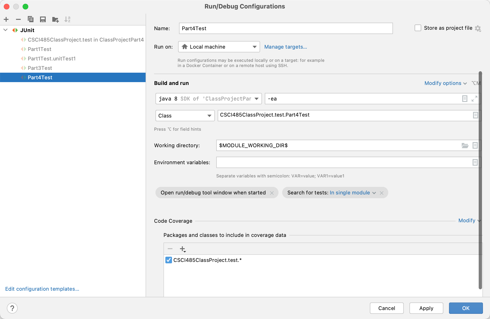
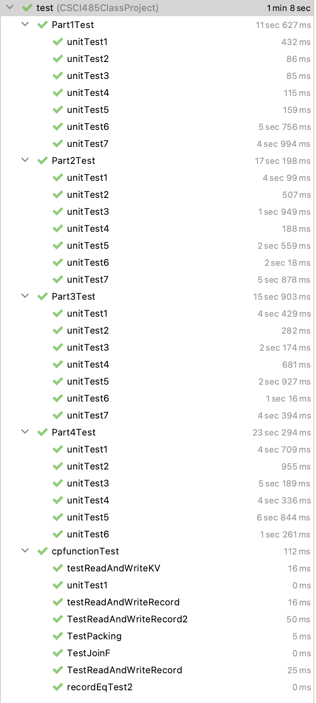

# Class Project: Part 4

submission from Zhihan Wang 2233534677 zhihanwa@usc.edu

# To run the project

Unzip the zip file to a directory

open the directory with IntelliJ

Run project with the following set up



Should get the following result



**Note:** rarely you will get transaction too old, just re-run it so that it works (its hard to reproduce). **Thank you for the semester! I really enjoy this class.**

/////////////

## Getting Started

You need to copy and paste the code of Part 1, 2 and 3 to this project. 
Your codes need to be put under `src/CSCI485ClassProject/` and its subdirectories. 
Verify correctness by executing the unit test of Part1/Part2/Part3 successfully.

## Project Structure Overview

- `lib`: the dependencies of the project
- `src`: the source codes of the project
  - `CSCI485ClassProject`: root package of the project
    - `models`: package storing some defined representations of models in the database.
    - `test`: package for unit tests
    
## Codes to implement
Under `src/CSCI485ClassProject`, there are 2 classes to finish:
- `RelationalAlgebraOperatorsImpl`: implementation of an interface class `RelationalAlgebraOperators`
- `Iterator`: `Iterator` is an abstract class of the concept of Iterator. 
You need to implement derivative classes of `Iterator` to implement required features.

## Run Tests on macOS/Linux using `make`

If you are developing in `macOS/Linux` environment(recommended), we provide `Makefile` for you to run tests quickly.

To run tests of partX, use command
```shell
make partXTest
```

As you may have different project structures, Makefile may not work in your implementation. In this case, you can change the `sources` variable in Makefile by adding the name of the java files you created to it.
Note that the order of the file should align with the class dependency relationship, i.e. class `A` imports `B`, then `B.java` should be in front of `A.java` in `sources`.
